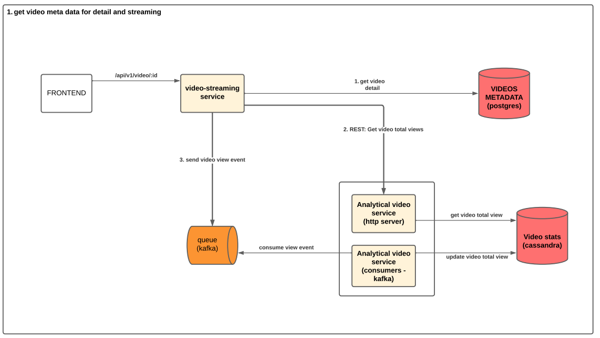
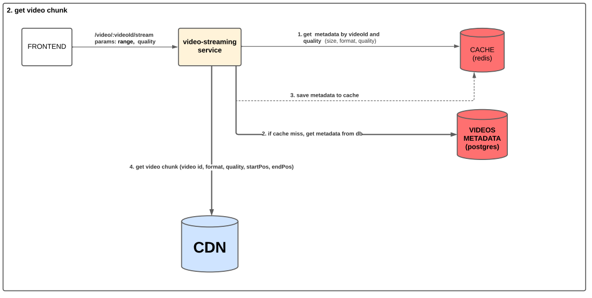
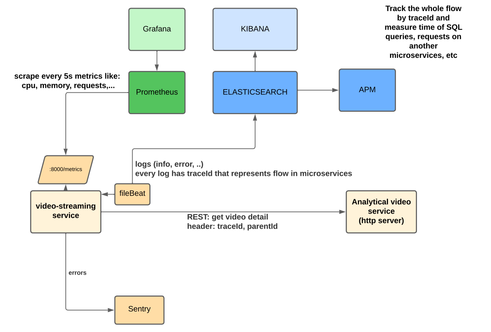

# Table of Contents

- [Introduction](#introduction)
- [Launch](#launch)
- [Architecture](#architecture)
- [Observability](#observability)
- [Video](#video)

## Introduction

I have experience with nestjs, but I only tried this project with express.
The tests are missing, but here is a link to another project where I wrote unit tests and integration tests.
- https://gitlab.com/food-delivery5161742/commerce

This project is composed of three services:
- frontend
- video service (it streams videos and returns metadata)
- video-analytical-service (it stores stats about videos)

## Launch

- Look in the sub projects readme.

## Architecture
*Frontend*

*Get video metadata*

*Stream video*

## Observability

## Video

